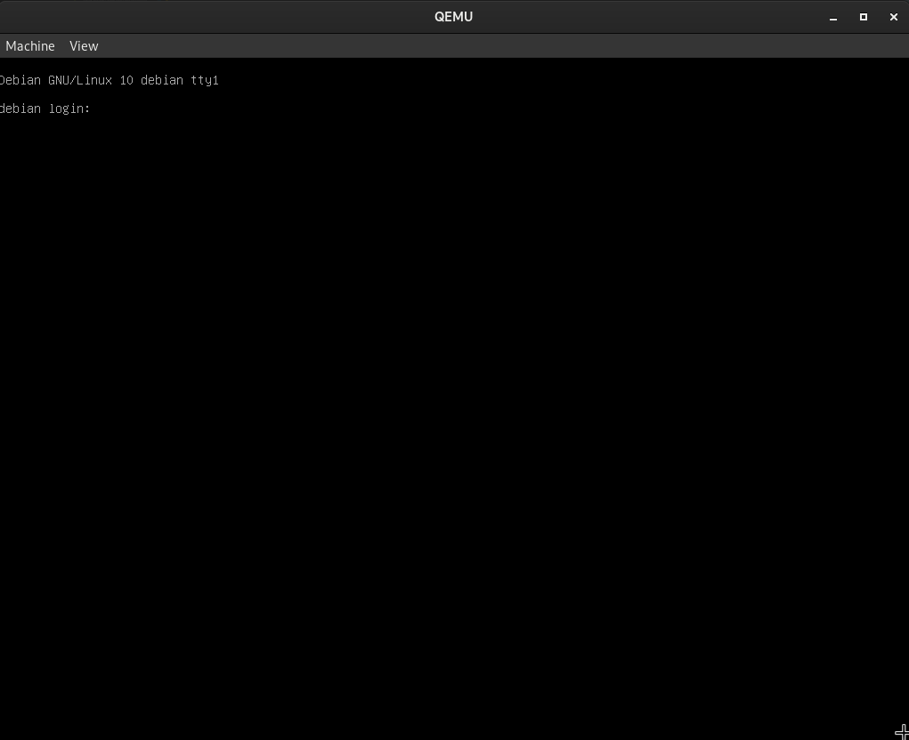

# Trabajando con libvirt/KVM

### Crear una máquina virtual en libvirt/KVM, usando una imagen de buster y utilizando aprovisionamiento ligero.

Vamos a crear una máquina virtual con la iso de Debian Buster en un fichero de `qcow2` de 10GB.

###### Creación del fichero `qcow2`:
~~~
qemu-img create -f qcow2 Buster.qcow2 10G
    Formatting 'Buster.qcow2', fmt=qcow2 size=10737418240 cluster_size=65536    lazy_refcounts=off refcount_bits=16
~~~

Hemos creado el fichero `qcow2`, el cual vamos a utilizar como dispositivo de almacenamiento para instalar Debian. Este irá aumentando de tamaño, de forma dinámica, hasta 10 GB.

Ahora vamos a iniciar la máquina para instalar Debian Buster. Vamos a indicar la ruta del fichero `qcow2`, la memoria RAM que queremos que tenga y la ruta de la iso. 

###### Iniciamos la máquina virtual.
~~~
kvm -m 1024 -hda /home/moralg/MaquinaQemu/Buster.qcow2 \
-cdrom /home/moralg/Documentos/ISO/Debian10.iso
~~~

Nos saltará una ventana con el instalador de Debian, el cual instalaremos y cuando lo tengamos apagaremos la máquina.

Ahora vamos a crear una imagen utilizando el aprovisionamiento ligero con la imagen `Buster.qcow2`, en la que acabamos de instalar Debian.

###### Creamos una nueva máquina virtual con aprovisionamiento ligero `Copia-Buster.qcow2`
~~~
qemu-img create -b Buster.qcow2 -f qcow2 Copia1-Buster.qcow2
    Formatting 'Copia1-Buster.qcow2', fmt=qcow2 size=10737418240 backing_file=Buster.qcow2 cluster_size=65536 lazy_refcounts=off refcount_bits=16
~~~

Ahora tendremos una copia creada con aprovisionamiento ligero, la cual podemos iniciar de manera inmediata y con las mismas caracteristicas que la imagen original.

> Nota: Una recomendación sería instalar los paquetes, configurar y actualizar todo lo necesario para tener una imagen original lista para realizarle copias con aprovisionamiento ligero y trabajar con las copias de estas.

###### Podemos iniciar la Copia con el siguiente comando:
~~~
kvm -m 1024 -hda /home/moralg/MaquinaQemu/Copia1-Buster.qcow2
~~~

